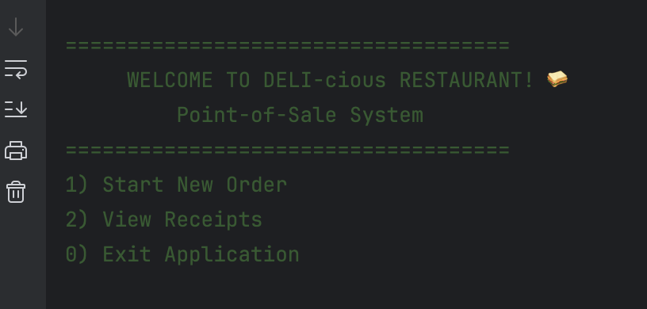
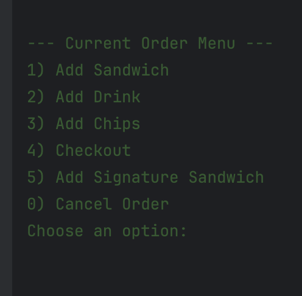
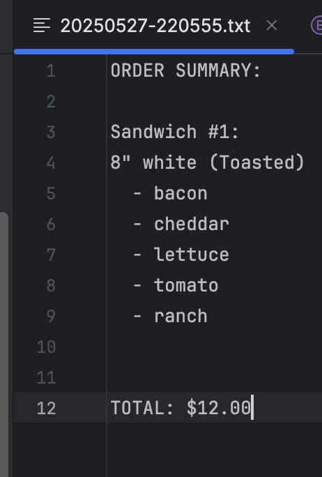

# 🥪 DELI-cious

A Java-based Point-of-Sale CLI application for a sandwich shop. Customers can build custom sandwiches, add drinks and chips, and receive itemized receipts. Built using Object-Oriented Programming principles and stores order history as receipt files.

<details>
<summary>💡 Technologies Used</summary>

- **Java 17**
- **Object-Oriented Programming (OOP)**
- **File I/O (BufferedReader, FileWriter)**
- **Java Time API (LocalDateTime, DateTimeFormatter)**
- **Collections API (ArrayList, List)**
</details>
<details>
<summary>🧩 Features</summary>

### 🏠 Home Menu:
- Start a new order
- View past receipts
- Exit application

### 🥪 Sandwich Builder:
- Select sandwich size (4", 8", or 12")
- Choose bread (white, wheat, rye, wrap)
- Add toppings: meats, cheeses, regular toppings
- Add sauces (mayo, mustard, ketchup, etc.)
- Optionally toast the sandwich

### 🥤 Add-ons:
- Add drinks (size and flavor)
- Add chips (type)

### 📄 Checkout:
- View itemized receipt with total
- Save receipt to the `/receipts` folder using a timestamped filename

### ⭐ Signature Sandwiches:
- BLT (bacon, cheddar, lettuce, tomato, ranch)
- Philly Cheese Steak (steak, American cheese, peppers, mayo)
- Can be customized after selection
</details>
<details>
<summary>🖥️ Application Interface</summary>

#### 🏠 Home Menu:


#### 🥪 Sandwich Builder:


#### 📄 Receipt Output:


</details>
<details>
<summary>📁 File Structure</summary>
src/
└── main/
└── java/
└── deli/
├── models/
│ ├── Bread.java
│ ├── Cheese.java
│ ├── Chips.java
│ ├── Drink.java
│ ├── DrinkSize.java
│ ├── Meat.java
│ ├── Order.java
│ ├── RegularTopping.java
│ ├── Sandwich.java
│ ├── SignatureSandwich.java
│ └── Topping.java
├── services/
│ ├── OrderService.java
│ └── ReceiptService.java
├── ui/
│ ├── HomeMenuUI.java
│ └── OrderUI.java
├── utils/
│ └── InputHelper.java
└── Main.java
receipts/

- **models/** – Contains core business classes for sandwich parts and the order itself.
- **services/** – Handles business logic like processing orders and generating receipts.
- **ui/** – CLI screens for user interaction.
- **utils/** – Utility classes for input handling and validation.
- **receipts/** – Folder where receipts are saved as `.txt` files after checkout.

</details>


<details>
<summary>🚀 How to Run</summary>

1. Ensure **Java 17** or later is installed.
2. Navigate to the project root.
3. Compile the project:
   ```bash
   javac deli/Main.java
Run the program:


java deli.Main
</details> 